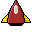

# Solaroids!
The [weiiiirdest](solugebefola.github.io/Solaroids) game of asteroids that you have played in the last week.  Solaroids is Built using Javascript and HTML's Canvas. It incorporates madrobby's  [keymaster.js](https://github.com/madrobby/keymaster) library.
## How to play
#### Ship

You are a small retro-sprite ship with some basic abilities.
- `←` `→` to turn.
- `↑` to thrust at normal speed.
- `b` for 5 times boost
- `space` to fire your scatter beam

#### Asteroids

They are also retro-spritely, but not retro-friendly. If you collide with one, that's it. Game over.  So don't do it!  Shoot them instead, classic asteroids style.

#### Solaroids (yes, they exist!)
_(mysteriously, no recorded image)_

These are harmless spheres of expanding 'nearly intangible matter'.  If you shoot them, they will shrink, and if they get small enough, they will disappear, otherwise they will keep expanding again. '_but wait!_' you say 'if they are so harmless, why should I care?'

'__AHA!__' I reply.  The Solaroids obscure your vision so you can't see yourself _or_ the asteroids.  If they fill the screen, it's going to be hard to survive...
